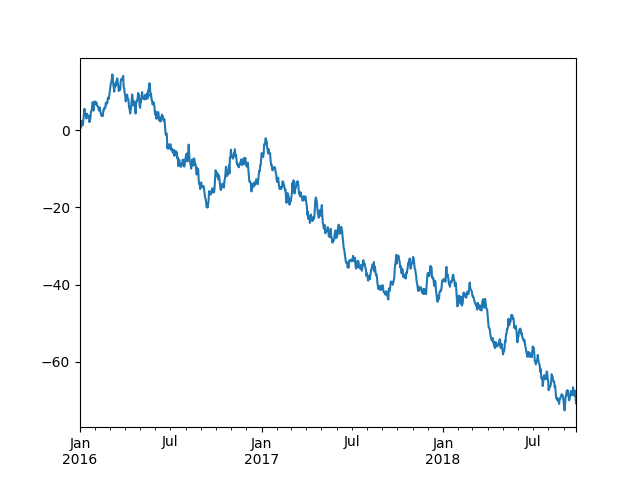

# 臺大資訊營 - Python

<p align="right">WooLNinesun & openopentw, 2017.07 @ NTU CSIE Camp</p>

## 程式語言

　　語言是人與人之間的溝通工具，程式語言就是人對電腦的語言，而語言有__閱讀順序__和__語法規則__，程式語言當然也不例外。一個符合語法規則的程式碼，就像是劇本一樣，電腦就會依造閱讀順序一行一行的循序漸進，不會跳過任何一句台詞。我們將在這一堂課學到電腦在面對程式語言是怎麼閱讀的，要怎麼去寫出電腦能看得懂的語言。

## 語言簡介 - Python

　　在這一堂課裡我們要來介紹 Python 這一套功能強大但易讀、易學、易維護的程式語言。你或許聽過，或許沒聽過。程式語言不只有 Python，為什麼我們單單要來介紹它呢？因為 Python 有幾項特點：

1. 物件導向的高階動態程式語言：

   Python 具有許多物件導向的特性，可以讓撰寫的人用更直觀的方式去寫程式碼。撇開物件導向的議題不談，Python 通常也可以靠比較短的程式碼完成比較多的功能，或者可以寫得比較清楚。

2. 直譯式語言：

   Python 還擁有直譯式語言的特性，寫完可以馬上執行，不需要經過編譯，讓 Python 開發速度加快許多。

3. 跨平台：

   各種主要的作業系統都支援 Python。Python 程式常常不需要修改，便可以同時在 Linux 與 Windows 平台上執行，即使撰寫 GUI 程式 (圖形使用者介面 Graphical User Interface，Python 透過 `PyGTK`, `wxPython` 等模組來撰寫) 也是一樣。所撰寫的 Python 程式透過標準的 `distutils` (模組) 進行包裝後，用標準的方式即可安裝於各種平台；在 Windows 下更可以自動產生方便的可執行 installer。

4. 容易擴充：

   Python 因為易讀、易學、易維護的特性，擁有龐大的討論社群和模組，再加上跨平台的特性，這些模組的使用和安裝方式，與內建的模組完全一樣。最棒的是，撰寫的方法並不困難！

　　Python 的設計哲學是「優雅」、「明確」、「簡單」，也因為這種設計哲學造就了 Python 的各項特性。

　　Python 開發者的哲學是：__「做一件事，最好只有一種簡單的方法」__。在設計 Python 語言時，如果面臨多種選擇，Python 開發者一般會拒絕花俏且複雜的語法，而選擇明確沒有或者很少有歧義的語法。這些準則被稱為__Python格言__。

## 編輯程式

### 對開發者來說什麼是程式呢？

　　在學習語法之前，我們要先了解工程師是怎麼看待程式的！對工程師來說程式就是一種將一大堆資料做處理，轉換成我們想要的資料或決策，進而產生出結果。所以在寫程式時要有一種觀念，__我們是在處理資料__！

### 對系統來說什麼是程式呢？

　　程式在未執行時，就只是一份檔案，差別就在於用什麼方式去打開他而已！有可能今天有一個 `.png` 的圖檔，用 `圖片檢視器` 開起來是一張正常的圖片，但如果用 `文本編輯器` 打開又可以看到其中夾雜的密碼。附檔名最大的目的是在於幫助系統辨別這個檔案要用什麼方式去開啟。

　　在上一段落有提到工程師對於程式的看法-__處理資料__，那些打開的方法其實就是在用不同的方式(程式)去閱讀那份檔案裡面的內容而已！可能是用不同編碼系統，或是不同的處理方式等等。

　　剛剛有提到文本編輯器(Text Editor)，這東西是用來把一份檔案的內容通通用特定編碼的文字來顯現出來！常見的文本編輯器 Notepad++、Vim、Emacs、Visual Code、… ，這堂課不會特別介紹每個文本編輯器，有興趣的同學可以回家再查查看。

## Python基本語法

　　在這一章節，我們會介紹 Python 基本的**語法**（片語、文法），只要照著語法來寫**程式碼**（劇本），就可以讓 Python 照著程式碼來做事情。為了避免描述太抽象，讓大家不好理解，我們會給很多範例。大家可以交互參看範例和說明，比較好理解內容。

### 基礎概念

#### 變數

　　寫程式的時候，多數的操作都會對變數(variable)進行，我們先介紹關於變數的概念和怎麼使用。把變數想像程式一個儲存資料的容器，你可以把一個值指定給變數。指定變數的值的方法和數學很像，就是讓`{變數的名字} = {變數的值}`。例如讓 `a = 6` 之後，`a` 裡面就儲存了 `6` 這個值，之後就可以對 `a` 作一些操作（例如加減乘除）。

　　下面這個例子把 `6` 指定給變數 `a`，把 `3.02` 指定給 `b`，然後把 `a+b-2` 指定給 `a`，所以現在 `a` 就是 `7.02`。最後，把 `'blablabla'` 指定給 `x`，所以 `x`  就是 `blablabla`。

**程式碼**

```python
a = 6
b = 3.02
a = a + b - 2      # a 會是 7.02
x = 'blablabla'    # x 會是 'blablabla'
```
　　變數的名字是由任意長度的**英文字母**、**底線**、或**數字**組成，但是第一個字元一定不能是**數字**。例如`x`、`Apple`、`_soft_wool`、`shop01` 就是合法的變數命名，而 `01shop` 就不是可以用的變數名稱（因為第一個字元是數字）。變數的值就是各式各樣的資料，資料的類型分成很多種，在下一個章節就會介紹到。

#### 函式（function）


　　直接舉一個例子來說明，例如有一個函式是 `gcd()`，給 `gcd()` 兩個數字之後，會幫你算出這兩個數字的最大公因數。在這過程中你完全不需要知道他是怎麼計算的，就像是黑盒子一般，只要給資料，就會有結果產生。

　　函式的使用方法就是：在函式後面的 `()` 裡面放入要給函式的資料；如果要放很多個資料的話，可以用 `,` 隔開。如果要接收函式回傳的資料的話，就要把函式當成 `「變數的值」`，也就是讓 `變數 = 函式(給它的資料)`。

**程式碼**

```python
from math import gcd   # 讓 log 和 gcd 這兩個函式可以被使用（後面會再提到）

b = gcd(15, 10)    # b 會是 5
```

#### 輸入（input）、輸出（print）

　　輸出指的是讓程式把資料在螢幕上面（或儲存到檔案裡面）。例如可以使用 `print()` 這個函式來輸出。使用的方法就是把要輸出的資料放到 `print()` 的 `()` 裡面。當程式跑到這裡時，就會把括號裡面的資料輸出到螢幕上面（或檔案裡面）。

**程式碼**
```python
print(37)
print("This is a sentence.")
x = 4
print(x)
```
**輸出**
```
37
This is a sentence.
4
```

　　有輸出就會有輸入，輸入就是讓程式取得外部的資料（鍵盤的輸入或是檔案內容）。例如可以使用 `input()` 這個函式來輸入。使用的方法就是讓一個變數將 `input()` 的回傳值儲存起來（ `x = input()` )。當程式跑到這一行時就會停下來等待人用鍵盤打字，當人打完字之後，打的句子就會記錄到 `x` 裡面了。之後就可以對 `x` 做一些你想做的操作了，例如可以用上面剛提到的 `print()` 把 `x` 印到螢幕上面。

**程式碼**
```python
a = input()        # 人在鍵盤打上"5"
print(a)
b = input()        # 人在鍵盤打上"stringgggg"
print(b)
```
**輸出**
```
5
stringgggg
```

#### 註解（comment）

　　有時候會想在程式碼中向別人說明一些事情，但是不想讓說明的文字被當成程式碼執行，這時候就可以使用註解。常用的註解的方法有 2 種：

-   行註解：加上 `#` 符號，則那一行符號後的文字都不會執行。

-   如果要讓很多行文字不執行的話，也可以用 `"""   """` 或 `'''   '''` 把文字括起來（三個單或雙引號）

　　例如下面的程式碼中只有第 1 行、第 2 行、第 6 行會被執行，其他行的字都被註解而不會執行。

**程式碼**
```python
print('Line 1')
# 說明文字(這一行不會被執行)
print('line 2')
# print('line 3')
"""
print('line 4')
print('line 5')
"""
print('line 6')
```
**輸出**
```
Line 1
line 2
line 6
```

　　另外，在寫程式的時候，大家也很常把某段不想執行的程式碼暫時註解起來，這樣這些程式碼就不會執行了。這也是註解很常用的功能之一。

### 資料型別

　　在 Python 裡面資料具有型別，型別可以分為四種：

| 資料型別             | 意思                             | 舉例                    |
| ---------------- | ------------------------------ | --------------------- |
| **布林（`bool`）**   | `True` or `False`              | `True`、`False`        |
| **整數（`int`）**    | 跟數學意義上的整數一樣，不會有小數點的出現          | `0`、`87`、`-1210`      |
| **浮點數（`float`）** | 有小數點的數字，包含整數(小數點補 0)           | `0.0`、`12.34`、`-13.0` |
| **字串（`str`）**    | 句子，裡面可以是任意**文字**、**符號**或**數字** | `"This is an apple"`  |

　　四個資料型別中要特別介紹字串，就是把很多**文字**、**數字**、**任意符號**串起來的東西。用 `" "` 或 `' '` 把句子括起來，程式才會把這一串字母當成字串型別的資料。例如 `"string"`、`"long long sentence"`、`'another quote'` 就是正確的字串，而 `no quote`、`"single quote`、`"different quote'` 這些就是錯誤的字串。

　　這裡有個額外的小提醒，布林型別的 `True` 和 `False` 第一個字母記得要大寫且不用加引號。

　　如果一個變數被賦予了資料，這個資料的型別就會是這個變數的資料型別，每個資料型別都有自己的特性。例如可以對**浮點數**型別的變數做除法，卻不可以對**字串**型別的變數做除法（人類來做「除以字串」，人類也不知道怎麼做吧？）。所以知道一個變數或資料的資料型別是相當重要的事情。

- 可以使用 `type()` 來看現在變數或資料的型別是什麼。例如：
  - `type(6)` 的回傳值就會是 `int`
  - `type("fine")` 的回傳值就會是 `str`


- 可以使用資料型別函式轉換變數的型別，例如：
  - `str(6)` 的回傳值就會是字串的 `'6'`
  - `int('24')` 的回傳值會是整數的 `24`
  - `float(32)` 就會是浮點數的 `32.0`

**程式碼**
```python
a = True              # 布林 bool
print(type(a))
b = 85                # 整數 int
print(type(b))
c = "123.7"           # 字串 str
print(type(c))
print(float(c))       # 把123.7轉成int的時候，Python會自動把小數點以下的位數無條件刪去
print(type(float(c)))
```
**輸出**
```
<class 'bool'>
<class 'int'>
<class 'str'>
123.7
<class 'float'>
```

### 資料序列

　　如果把全班所有學生的身高都整理起來，就會是一個資料的集合，這個資料的集合第 0 個值是第 1 個學生的身高、第 1 個值是第 2 個學生的身高、……依此類推。以圖形來看這個例子的話會是這樣：

| 0    | 1    | 2    | 3    | 4    |
| ---- | ---- | ---- | ---- | ---- |
| 155  | 162  | 187  | 167  | 170  |

#### List

　　例子中的 list 的定義方法：`heights = [155, 162, 187, 167, 170, 177, 187, 163]`。將資料用 `,` 隔開並使用 `[]` 包起來存進 heights 這個變數裡面。

　　定義了 `heights` 之後，就可以用 `heights[0] ` 來取得第1個學生的身高，用 `heights[3]` 來取得第 4 個學生的身高。這裡特別注意到：**list的第 1 項資料的編號是 0，而不是 1！**這種編號方法在許多程式語言中相當常見，程式新手而言可能很常忘記，要特別注意！

**程式碼**
```python
heights = [155, 162, 157, 167, 170]

print( heights )
print( heights[0] )
print( heights[-1] )
print( heights[2:4] )

print( heights[3] )
heights[3] = 87
print( heights[3] )

print( len(heights) )    # len()可以取得heights的元素數量
```
**輸出**
```
[155, 162, 157, 167, 170]
155
170
[157, 167]
167
87
5
```

#### Tuple

　　tuple 和 list 很相似，但是定義的時候是用小括號 `()` 括起來。例如在同樣的例子 tuple 會這樣定義：`heights = (155, 162, 187, 167, 170, 177, 187, 163)`。

　　定義了 `heights` 之後，一樣是用 `heights[0]` 來取得第 1 個學生的身高，用 `heights[3]` 來取得第 4 個學生的身高（這裡和 list 一樣是中括號 `[]` 不是 `()`）。

　　另外和 list 不一樣的是：tuple 具有唯讀性質，定義好之後，就不能更動 tuple 裡面的元素(包含增加減少等操作)，想換的話只能把整個 tuple 替換掉。例如不能像 list 一樣做出 `heights[3] = 87` 的操作

**程式碼**
```python
heights = (155, 162, 157, 167, 170)

print( heights )
print( heights[3] )
print( len(heights) )

# heights[3] = 87              # 這行會出錯，程式會中止，因為tuple不能換個別元素

# 正確作法。tuple只能重新定義，不能只換部分元素
heights = (155, 162, 157, 87, 170)
print( heights )
```
**輸出**
```
(155, 162, 187, 167, 170)
167
5
(155, 162, 157, 87, 170)
```

#### Dictionary

　　dictionary 比較特別，可以自己定義數字或字串來編號。例如 `'Alice'` 是 `155`、 `'Bob' `是 `162`、 `'Carol' `是 `187`。以圖像來看會是這樣：

| Alice | Bob  | Oscar |
| ----- | ---- | ----- |
| 155   | 162  | 187   |

　　dictionary 的定義方法就會是這樣：`heights = { 'Alice': 155, 'Bob': 162, 'Carol': 187 }`。定義了 `heights` 之後，就可以用 `heights['Bob']` 來取得 `Bob` 的身高。

**程式碼**
```python
heights = { 'Alice': 155, 'Bob': 162, 'Carol': 187 }

print( heights )
print( heights['Bob'] )
print( len(heights) )
```
**輸出**
```
{'Bob': 162, 'Carol': 187, 'Alice': 155}
162
3
```

#### String

　　其實字串也是一種資料序列，而且字串的性質和 tuple 一樣具唯讀性質。也就是說，可以用 `'vegetable'[4]`來取得 `'vegetable'` 的第 5 個字元，也就是 `'t'`，也可以用 `len('vegetable')` 來取得 `'vegetable'` 的長度 `9`。

### 運算子

　　運算子就是可以對變數或資料做操作，主要可以分成下列幾種，會依序的介紹。

| 種類   | 運算子                         |
| ---- | --------------------------- |
| 算術   | `+` `-` `*` `/` `**` `%`    |
| 指定   | `=` `+=` `-=` `*=` `/=`     |
| 比較   | `==` `!=` `<` `>` `<=` `>=` |
| 邏輯   | `and` `or` `not`            |
| 特殊   | `in`                        |

#### 算術

　　最常見的算術運算子就是 `+`、`-`、`*`、`/`、`%`、`**`，分別代表**加**、**減**、**乘**、**除**、**取餘數**、**次方**，它們可以作用在數字型態的變數。它們的用法和數學很像，可以參看下面例子。

　　另外也可以對序列做「加法」或「乘法」，在 Python 裡面，對序列做加法就是把東西接到序列的後面。可以參考下面例子的第 7 \~ 9 行：

**程式碼**
```python
a = 2 + 6              # 8
b = (a * 10) + 5       # 85
c = b - 45             # 40
d = 777 % 11           # 7
e = d / 4              # 1.75
f = 2 ** 16            # 65536

g = (1, 2, 3) + (5, 8) # 序列(tuple)的加法
h = f + 13             # 這行會出錯，因為13不是tuple，而是int
h = f + (13,)          # 這行才是正確的
```

#### 指定

　　最常見的指定運算子就是 `=`，就是會把右邊的資料計算好再賦值給左邊的變數。例如 `a = 8`，那麼 `a` 就會被賦值成 `8`；而如果 `b = a + 1`，那麼 `b` 會被賦值成計算好的 `9`。為了簡化程式碼，Python 可以用 `x += 2` 來縮寫 `x = x + 2`，上一小節的算術運算子都可以用這樣的方式縮寫。

**程式碼**
```python
a = (6 + 2) * 3     # 現在a是24
a /= 5              # 現在a是4.8
a -= 87 / 29        # 現在a是1.8
```

#### 比較

　　比較運算子包含 `==`、`!=`、`<`、`>`、`<=`、`>=`。它們的意思分別是：**等於**、**不等於**、**小於**、**大於**、**小於等於**、**大於等於**。它們的用法和算術運算子很像，可以參看下面的例子：

**程式碼**

```python
5 == 6           # False
"book" != "書"   # True
18 < 12          # False
13 <= 13         # True
```

#### 邏輯

　　邏輯運算子包含 `and` `or` `not`。它們的意思分別是：**且**、**或**、**不**。它們是用來進行 True 和 False 的邏輯運算，它們的作用結果如下表：

**`and`**（**且**）

```python
(True)  and (True)    # True
(True)  and (False)   # False
(False) and (True)    # False
(False) and (False)   # False
```

**`or`**（**或**）

```python
(True)  or (True)    # True
(True)  or (False)   # True
(False) or (True)    # True
(False) or (False)   # False
```

**`not`**（**不**）

```python
not (True)     # False
not (False)    # True
```

**程式碼**

```python
(5 == 6) and ("book" != "書")   # False
(18 < 12) or (13 <= 13)         # True
not (15 < 16)                   # False
([1,2,3,5] == [1,2,3]) and ((3>4) or not(4>3))   # False
```

### in

　　`in` 可以用來檢查一個元素有沒有在一個 list 或 tuple 裡面。用法就是去檢查 `{資料} in {list}`的值，也就是：如果資料有在 `list` 裡面，`{資料} in {list}` 就會回傳 `True`，否則就會回傳 `False`。

**程式碼**
```python
cor_list = [(12, 24), (1, 3), (0, 0)]    # 這是內容有3個tuple的list

print( (1, 3) in cor_list )
print( (12, 3) in cor_list )
```
**輸出**
```
True
False
```

### 條件判斷

#### if

　　當你希望先看某個**條件**有沒有成立，才決定要不要跑某段程式碼時，就可以使用 `if`。例如你可能要先看天氣有沒有變冷，變冷了才穿外套。在這個例子裡面，「天氣有沒有變冷」就是 `if` 要看的條件。`if` 的用法是：在 `if` 後面接 `判斷條件`，並加上冒號 `:`，接下來就可以寫下條件成立時要執行的程式碼。注意到這些湖和條件後要執行的程式碼要**統一往右縮排**，Python 才知道哪些程式碼是符合條件時才要執行的。`if` 底下還可以有 `if`，甚至可以有好幾層 `if`，但都要記得把縮排縮好縮滿！下面的例子的意思是：假如攝氏溫度比20度低，就穿上外套。而不管溫度高或低，都會打開電腦。

**程式碼**
```python
Celsius = 15

if Celsius < 20:
    print('Put on the coat.')

print('Turn on the computer.')
```

#### if … else

　　有時候，我們會想要在條件不成立的時候，另外再跑一段程式碼。這時候可以在 `if` 後面加寫 `else:`，這時候要跑的程式碼也是要向右縮排。例如下面的例子的意思是：假如攝氏溫度比20度低，就穿上外套；否則就打開冷氣機。而不管溫度高或低，都會打開電腦。

**程式碼**
```python
Celsius = 15

if Celsius < 20:
	print('Put on the coat.')
else:
	print('Turn on the air-conditioner.')

print('Turn on the computer.')
```

#### if … elif … else

　　我們會想要在假設條件不成立的時候，再檢查另一個條件，符合的話就執行一段程式碼，不成立的時候才執行另一段程式碼。這時候就可以在 `if` 後面再加寫 `elif`（意思是：else if），再寫 `要檢查的條件`，最後一樣加上 `:`。下面符合條件後要執行的程式碼也是要向右縮排。例如下面的例子的意思是：假如攝氏溫度比`20`度低，就穿上外套；不然如果溫度比`25`度低，就打開電風扇；否則就打開冷氣機。而不管溫度高或低，都會打開電腦。

**程式碼**
```python
Celsius = 15

if Celsius < 20:
	print('Put on the coat.')
elif Celsius < 25:
	print('Turn on the electric fan.')
else:
	print('Turn on the air-conditioner.')

print('Turn on the computer.')
```

### 重覆迴圈

　　如果想要重複執行一段程式碼，就可以使用迴圈。迴圈有兩種用法，一種是 **while**，一種是 **for**，接下來會分別介紹。

#### while

　　`while` 會重複執行一段程式碼，直到某個條件不符合了，才停止執行這段程式碼。`while` 的用法和 `if` 類似，就是在 `while` 後面寫一個條件，最後加上 `:`。意思是說：只要符合這個條件，Python 就會一直執行需要重複執行的程式碼，直到條件不再符合為止。另外`while`裡面的程式碼也跟`if`裡面的程式碼一樣要向右縮排。例如下面的程式碼中，第一段程式碼會輸出 `1 ` 到 `10 ` 的所有數字。第二段程式碼會從 `20` 往下找到第一個整除 `7` 的數字，並輸出。

**程式碼**
```python
num = 0
while num < 10:
	print(num, end=' ')   # 輸出的時候，最後不要換行，而是改成以空白間隔
	num += 1
print('')                 # 輸出換行

num = 20
while num > 0:
	if num % 7 == 0:
		print(num)
		break            # 當程式執行到這一行時，就會跳出最近的一個迴圈
	num -= 1
```

**輸出**

```
0 1 2 3 4 5 6 7 8 9
14
```

#### for ... in ...

　　`for` 和 `while` 一樣會重複執行一段程式碼，但是不同的是：`for` 會有一個明確的執行次數，而不是條件不符合了才停下來。`for` 很常和 `range()` 一起合用，例如 `for i in range(100):` 就是會重複 100 執行ㄅ次，並且 `i` 的值會從 0 跑到 99。可以看以下例子：

**程式碼**
```python
for i in range(10):
    print(i, end=' ')
print('')
```
**輸出**
```
0 1 2 3 4 5 6 7 8 9
```

　　而 `range(n)` 是一個函式，會回傳一個 `list` 包含有從 `0` 到 `n-1`。例如 `list(range(10))` 其實就是 `[0, 1, 2, 3, 4, 5, 6, 7, 8, 9]`。
而 `for i in range(n)`，就是讓 `i` 的值從 List 的第一個元數跑到最後一個元素，就是 `0` 跑到 `n-1`。

所以其實 `for` 的 `in` 後面不一定要接 `range(n)`，也可以給一個 list 、 tuple 或 string ，這時候 `i` 的值就會從 list、tuple 或 string 的第一項跑到最後一項。可以看下面的例子：

**程式碼**
```python
for x in [3, 5, 'HI', '中文字']:
    print(x, end=' ')
print('')

string = "Hello, World!"
for s in string:
    print(s, end=' ')
print('')
```
**輸出**
```
3 5 HI 中文字
H e l l o ,   W o r l d !
```

### 自訂函式

#### def

　　之前曾經提到過：函式（function）就像是一個黑盒子，而其實，這個黑盒子（函式）是可以自己量身打造的。自訂的方法就是使用 `def`。
用法是：`def 函式(給它的資料):`，`:` 之後就是黑盒子（函式）的程式碼，而這段函式要執行的程式碼要向右縮排（和之前的 `if`、`while` 一樣）。例如下面是自訂一個會自動輸出 debug 訊息的函式 `print_dubug()`：

**程式碼**

```python
def print_debug(message):
    DEBUG_msg = "DEBUG: " + message
    print(DEBUG_msg)
print_debug("lalala.")
```

**輸出**

```
DEBUG: lalala.
```

#### def ... return 

　　自訂的函式除了可以自動執行一些程式碼以外，還可以回傳資料。回傳的方法就是在 `def` 的程式碼加上 `return (回傳的資料)`。例如下面是一個會自動幫取絕對值的函式 `myabs()`。要特別注意：函式一旦跑到 `return` 之後就會停止執行這個函式，不管這個函式後面還有沒有程式碼。

**程式碼**

```python
def myabs(num):
    if num > 0:
        return num
    else:
        return -(num)
    print("This line will not be print.")    # 這一行一定不會被執行到，因為前面已經 return 了。

print(myabs(24.3))
print(myabs(-21))
```

**輸出**

```
24.3
21
```

　　另外，在函式裡面，除了可以傳數字或字串以外，也可以傳資料序列進去。下面的例子定義了一個會清空掉 `list` 第 `index` 項字串的函式。

**程式碼**

```python
def remove_list(lst, index):
    index += 1
    lst[index] = ''

index = 1
data = ['hello', 'byebye', 'morning', 'afternoon']
print(index)
print(data)
remove_list(data, index)
print(index)
print(data)
```

**輸出**

```
1
['hello', 'byebye', 'morning', 'afternoon']
1
['hello', 'byebye', '', 'afternoon']
```

　　在範例裡面，會發現一般型別的 `index` 的值沒有改動。但是上面的範例中 `data` 的第 2 項的確改動了。這是因為 `data` 是一個 `list`，在 Python 裡面，函式裡面的序列變動的話，外面的序列也會跟著變動。這個規則與多數一般的型別的特性不太一樣，寫程式碼時要特別注意！（詳細的原因可以上網查詢！）

### 類別物件

#### class

　　類別**（**class）是一種可以將一些變數(屬性)與函式(方法)包裝成物件的方式，一個 class 裡面的函式可以使用同一個 class 裡面的變數，也可以接收外部給予的變數。例如，可以把 `Human` 想成一種物件。這個物件裡面有 `身高`、`體重`、`年齡` 等屬性，另外可能會有 `計算BMI`、`長高`、`打架 等方法。

　　要取 class 裡面的屬性的話，就可以使用 `{class物件}.{class裡面的變數}` 來取得。例如：假設創造了 `Alice` 這個 `Human`，那麼就可以用 `Alice.身高` 來取得 `Alice` 的身高、`Alice.體重` 來取得 `Alice` 的 `體重`。

　　要執行**class**裡面的**函式**的話，有兩種執行方法：

- `{class物件}.{class裡面的函數}()`
  例如：可以用 `Alice.BMI()` 來自動計算 `Alice` 的 `BMI`、`Alice.長高()` 來讓 `Alice` 的 `身高` 變高。
- `{class名稱}.{class裡面的函數}({class物件})`
  例如：可以用 `Human.BMI(Alice)` 來自動計算 `Alice` 的 `BMI`、`Human.長高(Alice)` 來讓 `Alice` 的 `身高` 變高。

　　在下面這個例子中，要創造一個 `Human` 的時候，要先設定 `身高`、`體重`、`年齡` 這 3 個屬性。接下來可以讓這些 `Human` 有 `長高`、`打架` 的方法。

**程式碼**

```python
class Human:
    def __init__(self, height, weight, age):        # 創造一個 'Human', 傳入的參數是創造物件用的參數
        self.height = height
        self.weight = weight
        self.age = age
    def BMI(self):                                  # 計算 BMI
        return self.weight / ((self.height/100) ** 2)
    def grow_up(self, grow_height):                 # 讓一個 'Human' 長高
        self.height += grow_height
    def fight(self, human2):                        # 和別的 'Human' 打架時，自己的體重會下降，下降的數量是對方的體重的 20 分之 1
        self.weight -= human2.weight / 20

# 創造三個 Human 物件：Alice、Bob、Oscar
Alice = Human(182, 67, 17)
Bob   = Human(168, 60, 20)
Oscar = Human(175, 90, 21)

# Alic e和 Bob 互相傷害
Alice.fight(Bob)
Bob.fight(Alice)
# Oscar 長高 2 公分
Oscar.grow_up(2)

print( Alice.weight )
print( Bob.weight )
print( Oscar.height )

print( Human.BMI(Alice) )
print( Oscar.BMI() )
```

**輸出**

```
64.0
56.8
177
19.32133800265668
28.72737719046251
```

### 引入套件

#### import

　　Python 最方便的地方莫過於可以引入套件。所謂的「套件」可以想成別人事先寫好的一些函式。引入套件就是把別人寫好的函式拿來給自己用。

引入的方法就是在 `import` 後面加上套件的名稱。例如：`import math` 就把 `math` 引入到你的程式碼中。引入套件之後，就可以使用套件裡面的函式，例如`math.log()` 可以計算一個數字取 log 之後的結果。還可以使用 `from math import log` 來縮減程式碼，這樣一來就可以直接用 `log()` 來代替 `math.log()` 這個寫法了。下面的例子會隨機產生一個 `0` 到 `10` 的數字，取 `log` 再輸出。

**輸入**

```python
from math import log
import random                      # 用來產生隨機數字的套件

rand_num = 10 * random.random()
log_rand_num = log(rand_num)

print( log_rand_num )
```

**輸出**

```
0.18942722554022867
```

### 延伸學習

#### 運算單元：位元運算

　　其實對電腦而言，它只認得 `1` 和 `0`，所以電腦在操作硬體的時候，都是直接操作一堆 `1` 和 `0` 的。而這些 `1` 和 `0` 在經過適當的轉換之後，就會是我們平時在使用的 `int`、`float`、`str`、`list`、…… 等等。例如可能 `22` 這個整數會被表示成：`0001 0110`，因為 `22` 的二進位是 `10110`，而電腦可能會設定所有整數都要用 8 個 `1` 或 `0` 來表示，所以不足 8 位數的部分就補 `0`。**位元運算**就是電腦讓操作這些 `1` 和 `0`。Python 的位元運算子包含：`<<`、`>>`、`&`、`|`、`^`、`~`。

#### 對一般檔案的讀寫

##### 打開（open）、關閉檔案（close）

　　要使用 Python 讀或寫檔案之前，要先打開（`open`）檔案（就跟我們要打開記事本才能讀或寫 `txt檔` 一樣）。使用的方法就是 `open("{檔名}")`，再把這個函式回傳的值指定給一個變數（例如 `hello`），之後就可以用這個變數（`hello`）來代替這個檔名了。例如要打開 `hello.txt` 的話，就可以寫成這樣：`hello = open('hello.txt')`。這裡特別注意，如果是想要打開檔案來寫資料進去的話，要在 `open` 加上參數 `'w'`（代表 write）。例如寫成這樣：`hello = open('hello.txt', 'w')`。如果沒有加上這個參數的話，就只能讀取這個檔案而已。

　　雖然打開了檔案之後不一定要關閉，不過如果有之後沒有要用到的檔案的話，順手關閉檔案是一個好習慣。關閉檔案的方法就是把之前開啟檔案變數後面加上 `.close()`。例如要關掉剛剛開啟的 `hello` 的話，就可以這樣寫：`hello.close()`。

##### 寫入檔案（print）

　　在打開了檔案之後，就可以用 `print` 把資料寫入檔案裡面。使用的方法就是在 `print()` 裡面加上參數 `'file={檔案變數}'`。例如：`print('Hello~', file=hello)`。這裡要再次提醒打開檔案的時候，要加上參數 `'w'`，`print` 才能把資料寫入。例如下面的例子打開了 `hello.txt` 這個文件，並且寫入 `'Hello, txt!'`，再關掉 `'hello.txt'` 這個文件。這時候就可以打開 `'hello.txt'` 這個文件，裡面應該就會有一行字 `'Hello, txt!'`。

**程式碼**

```python
hello = open('hello.txt', 'w')
print('Hello, txt 0!\nHello, txt 1!\nHello, txt 2!', file=hello)
hello.close()
```

##### 讀取檔案（read）

　　在打開了檔案之後，除了可以把資料寫入檔案裡面，也可以只讀取檔案。讀取的方法就是在檔案變數後面加上 `.read()`，這時候 `read()` 這個函式就會回傳整個文件的內容，所以可以把這個內容指定給一個變數，之後就可以對這個變數操作一些事情。例如可以用 `hello_strs = hello.read()`，這時候 `hello_strs` 就會是 `hello.txt` 裡面的所有內文。另外還有 `readline()` 和 `readlines()` 也是很常用來讀檔的函式，有興趣的人可以自行 google 或問臺上的老師！

### 應用領域

　　由於 Python 本身跨平台且易讀易寫的特性，所以可以拿來應用在不同領域。所以如果有跨領域實作的需求的話，Python 可能會是很好的選擇。下面介紹了一些 Python 好用、常用的套件，可以應用在不同領域。

#### 統計分析（Pandas）、資料繪圖（Matplotlib）

　　Python 很常被用來分析資料以及把資料製成圖表，常用的套件有 **Numpy**（科學計算）、**Pandas**（統計分析）、**Matplotlib**（資料繪圖）。下面是一個簡單的範例，它會隨機生成 1000 個數字，並且輸出成圖片。

**程式碼**
```python
import numpy as np
import pandas as pd
from matplotlib import pyplot as plt

np.random.seed(8787)
ts = pd.Series(np.random.randn(1000), index=pd.date_range('1/1/2016', periods=1000))
ts = ts.cumsum()
ts.plot()
plt.show()
```



#### 機器學習（Scikit-learn、Tensorflow、Pytorch、Caffe、……）

　　Python 常見的機器學習的套件有非常多種，包括 **Scikit-learn**、**Tensorflow**、**Pytorch**、**Caffe**、…… 等等數不勝數。

下面是使用 **scikit-learn**(`sklearn`)來實作 `decision tree`。(不懂機器學習的人可參考禮拜五的機器學習課程)

```python
from sklearn.datasets import load_iris
from sklearn import tree
iris = load_iris()
clf = tree.DecisionTreeClassifier()
clf = clf.fit(iris.data, iris.target)
```

#### 網路爬蟲（Urllib、Lxml、BeautifulSoup）

　　Python 因為有簡單的寫法、底層程式碼可以用有效率的 C 來擴充、以及可以很方便的解析字串，所以非常適合拿來在網路上抓資料（俗稱**爬蟲**）。一般常用的套件有 **urllib**、**lxml**、**beautifulsoup**，它們常用的用途如下表：

| package           | 用途                                |
| ----------------- | --------------------------------- |
| **urllib**        | 用來下載網路上的資料                        |
| **lxml**          | 用來解析從網路上下載下來的資料                   |
| **beautifulsoup** | 功能同lxml。相較之下，優點是寫法較簡單，缺點是效率**很低** |

#### 架網站（Django、Flask）

　　Python 也可以用來架站，最常聽聞的就是 **Django** 和 **Flask**，Django 讓開發網頁更加簡單、快速。Django 注重程式碼的重複使用性和模組化，快速開發和 DRY 法則（**Don't Repeat Yourself**）。

#### 想要什麼，就有什麼，就去 `import` 吧

### 參考資料

1. Python官方文檔：https://docs.python.org/3/tutorial/index.html
2. Pandas官方文檔：https://pandas.pydata.org/
3. Scikit-learn官方文檔：http://scikit-learn.org/stable/
4. Google：http://www.google.com.tw
