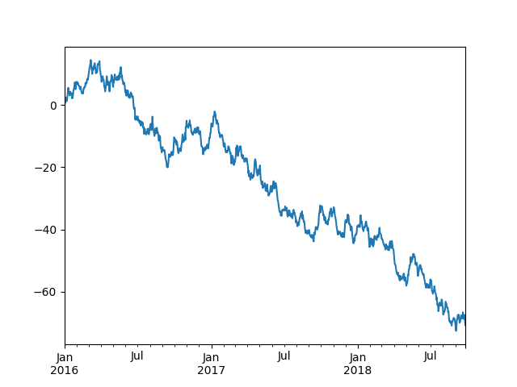

# 前情提要

## 程式語言

-   語言是人與人之間的溝通工具，程式語言就是人對電腦的溝通

-   語言的基本要素，閱讀順序和語法規則

-   人類可以自動排列，但電腦無法，只會一字一字讀

-   基本要素都符合：給電腦看的劇本

## 語言簡介

### Python 是什麼，哲學？

### Python Pros and Cons

### 關於程式語言的小知識：翻譯程序

## 編輯程式

### 對系統來說什麼是程式呢？

### 程式在未執行時，就只是一份檔案

### 文本編輯器（Notepad++、Vim、Emacs、Visual Code、… ）

# Python基本語法

在這一章節，我們將介紹怎麼用**Python**寫程式。

我們會介紹Python基本的**語法**（片語、文法），只要照著語法來寫**程式碼**（劇本），就可以讓Python照著程式碼來做事情。

為了避免描述太抽象，讓大家不好理解，我們會給很多範例。大家可以交互參看範例和說明，應該就蠻好理解我們想表達什麼了。

## 基礎概念

### 變數

寫程式的時候，多數的操作都會對**變數**進行，所以我們先介紹什麼是「**變數**」。

**變數**就像是國中數學裡面的`x`、`y`、`z`一樣，它代表一個不確定會是什麼的數字或是句子。你可以把一個值指定給它，之後就可以對它做一些操作。

指定變數的值的方法和數學很像，就是讓`{變數的名字} = {變數的值}`。例如讓`a = 6`之後，`a`裡面就儲存了`6`這個值，之後就可以對`a`作一些操作（例如加減乘除），然後`a`裡面存的值就會改變。

下面這個例子把`6`指定給變數`a`，把`3.02`指定給`b`，然後把`a+b-2`指定給`a`，所以現在`a`就是`7.02`。最後，把`'blablabla'`指定給`x`，所以`x`就是`blablabla`。

**程式碼**
```python
a = 6
b = 3.02
a = a + b - 2      # a 會是 7.02
b = 'blablabla'    # b 會是 'blablabla'
```
注意到，在`「變數的名字」=「變數的值」`之中：

「**變數的名字**」是由任意長度的**英文字母**、**底線**、或**數字**組成，但是第一個字母一定不能是數字。例如`x`、`yjc`、`_soft_wool`、`yjc87`就是好的變數命名，而`87yjc`就不是可以用的變數名稱（因為第一個字`8`是數字）。

「**變數的值**」則可能是**數字**或**句子**。如果是**數字**的話，就直接把數字寫上去就好了。如果是**句子**的話，就要用`" "`或`' '`把**句子**括起來，避免**句子**跟變數的名字混淆在一起，電腦無法判斷哪一個是句子，哪一個是變數。

上述的規則從上一個例子也可以看出來。

### 函式概念

**函式**是神奇的「黑盒子」，你給它一些它要的資料後，它就會幫你做事，還有可能再回傳給你一些資料。

例如`log()`這個**函式**，你給它一個數字之後，它就會幫你算那個數字取log之後的值。又或者是`gcd()`這個**函式**，你給它兩個數字之後，它會自己幫你算出這兩個數字的最大公因數，再回傳給你。

**函式**的使用方法就是：在**函式**名字的後面的括號放入要給它的資料。而要接收它回傳給你的資料的話，就要把函式當成`「變數的值」`，也就是讓`某個變數 = 函式`。也就是說，使用函式的規格是這樣：`某個變數 = 函式(給它的資料)`。例如下面的程式碼就是使用**函式**`log()`和`gcd()`來計算數字。

**程式碼**

```python
from math import log, gcd

a = log(100)         # a會是4.60517
b = gcd(126, 315)    # b會是63
```

### 輸入（input）、輸出（print）

**輸出**指的是讓程式把數字或句子**顯示**在螢幕上面（或儲存到檔案裡面）。

最常用的方法就是使用`print()`。使用的方法就是把要輸出的**數字**、**句子**、或**變數**放到`print()`的`()`裡面。當程式跑到這一行時，就會把括號裡面的**數字**、**句子**或**變數**的值輸出到螢幕上面（或檔案裡面）。

下面這個例子把`37`、`This is a sentence.`和`x`的值（`4`）印到螢幕上面：

**程式碼**
```python
print(37)
print("This is a sentence.")
x = 4
print(x)
```
**輸出**
```
37
This is a sentence.
4
```

跟輸出相反的，**輸入**就是讓程式**記錄**人用鍵盤打給程式的句子（或檔案裡面的句子）。

很常見的方法就是使用`input()`。使用的方法就是讓某一個「變數」（例如`x`）` = input()`。當程式跑到這一行時，就會停下來，等待人用鍵盤打字。當人打完字之後，打的句子就會記錄到`x`裡面了。

如果已經把句子記錄到`x`裡面了，之後就可以對`x`做一些你想對它做的操作了，例如可以用上面剛提到的`print()`把`x`印到螢幕上面。

下面是一個例子：

**程式碼**
```python
a = input()            # 人在鍵盤打上"5"
print( int(a) + 3 )
b = input()            # 人在鍵盤打上"stringgggg"
print(b)
```
**輸入**
```
5
stringgggg
```
**輸出**
```
8
stringgggg
```

### 註解（comment）

有時候我們會想在程式碼中間說明一些事情，然後不想讓說明的文字被當成程式碼執行，就可以使用**註解**。

常用的註解的方法有2種：

-   在文字的最前面加上`#`

-   如果要註解很多行的文字的話，可以用`"""   """`或`'''   '''`括起來（三個引號）

例如下面的程式碼中只有第1行、第3行、第9行會被執行，其他行的字都被**註解**掉了，不會被執行。

**程式碼**
```python
print('This line will be print')
# 說明文字(這一行不會被執行)
print('line 3')
# print('line 4')
"""
print('line 6')
print('line 7')
"""
print('line 9')
```
**輸出**
```
This line will be print
line 3
line 9
```

另外，其實在實際在寫程式的時候，大家也很常把暫時不想執行的程式碼**註解**起來，這樣這些程式碼就不會被執行了。這也是**註解**很常用的功能。

## 資料型別

在Python裡面，當你把一個值指定給一個變數時，Python其實會偷偷幫你紀錄這個變數的**型別**，也就是紀錄這個變數被指定的值是「哪一方面」的值。

更具體一點來說，型別可以分為兩大類：**數字**、**字串（string）**。它們分別代表的意思如下表：

| 資料型別           | 意思                                       |
| -------------- | ---------------------------------------- |
| **數字**         | 就數字                                      |
| **字串（string）** | 一個很長的句子，句子裡面可以是任意**英文字**、**符號**或**數字**（也可以是**中文字**） |

而**數字**型別裡面又分為三種型別：**布林（boolean）**、**整數（integer）**、**浮點數（float）**，分別有以下意思：

| 資料型別            | 意思                            |
| --------------- | ----------------------------- |
| **布林（boolean）** | 只有`True`、`False`（可以看成`1`、`0`） |
| **整數（integer）** | 跟數學意義上的整數一樣，不會有小數點的出現         |
| **浮點數（float）**  | 可以有小數點的數字                     |

如果一個變數被指定了型別，那麼就不能對這個變數做「不能對這個型別做的事」。例如你可以對**浮點數**型別的變數做除法，卻不可以對**字串**型別的變數做除法。（就算不是電腦，而是讓人類來做「除以**字串**」，人類也不知道怎麼除吧？）

另外，在Python裡面，可以用`type()`來看現在這個變數的型別是什麼，用法就是把變數的名稱放到`type()`的`()`裡面。

另外也可以手動轉換型別，例如`str(6)`就會是**字串**的`'6'`、`int('24')`會是**整數**的`24`、而`float(32)`就會是**浮點數**的`32.0`。

### 數字

**程式碼**
```python
a = True
print(type(a))
b = 85
print(type(b))
c = 123.7
print(type(c))
print(int(c))
print(type(int(c)))
```
**輸出**
```
<class 'bool'>
<class 'int'>
<class 'float'>
123
<class 'int'>
```

### 字串（string）

**字串**就是之前一直講到的「**句子**」，也就是把很多**英文字母**、**數字**、**符號**串起來的東西。注意到，要用`" "`或`' '`把句子括起來，程式才不會把這一串字母當成變數。

例如`"string"`、`"long long sentence"`、`'another quote'`就是正確的字串，而`no quote`、`"single quote`、`"different quote'`這些就是錯誤的字串（因為沒有用`" "`或`' '`把句子括起來、只有一邊有括號、兩邊的括號不一樣）。

## 資料陣列

**資料陣列**指的是把很多個資料整理在一起的變數。這麼說可能很抽象，可以先閱讀下面的**list**作為範例，就會比較能理解「把資料整理在一起」是什麼意思。

### List

如果把全班所有學生的身高都整理起來，就會是一個**list**，這個**list**的第**0**個值是第**1**個學生的身高、第**1**個值是第**2**個學生的身高、……依此類推。

以圖形來看這個例子的話會是這樣：

| 0    | 1    | 2    | 3    | 4    |
| ---- | ---- | ---- | ---- | ---- |
| 155  | 162  | 187  | 167  | 170  |

而這個例子的list的定義方法就會是這樣：`heights = [155, 162, 187, 167, 170, 177, 187, 163]。`

定義了`heights`之後，就可以用`heights[0]`來取得第1個學生的身高，用`heights[3]`來取得第4個學生的身高。

這裡特別注意到：**list的第1項資料的編號是0，而不是1！**

這種編號方法在許多程式語言中相當常見，在某些情況下會讓程式碼變得很好寫。不過對程式新手而言可能很常忘記，要特別注意！

下面這個例子做了這些事情：使用**list**紀錄身高、輸出身高、更改第4個人的身高並輸出、最後再輸出這個**list**的元素的數量。

**程式碼**
```python
heights = [155, 162, 157, 167, 170]

print( heights )
print( heights[0] )
print( heights[-1] )
print( heights[2:4] )

print( heights[3] )
heights[3] = 87
print( heights[3] )

print( len(heights) )    # len()可以取得heights的內容數量
```
**輸出**
```
[155, 162, 157, 167, 170]
155
170
[157, 87]
167
87
5
```

### Tuple

**tuple**和**list**很相似，但是定義的時候是用小括號`()`括起來。例如：`heights = (155, 162, 187, 167, 170, 177, 187, 163)`。

定義了`heights`之後，一樣是用`heights[0]`來取得第1個學生的身高，用`heights[3]`來取得第4個學生的身高（這裡是中括號`[]`）。

另外和list不一樣的是：tuple定義好之後，就不能換掉裡面的元素，想換的話只能把整個tuple換掉。

下面給個例子：

**程式碼**
```python
heights = (155, 162, 157, 167, 170)

print( heights )
print( heights[3] )
print( len(heights) )

# heights[3] = 87              # 這行會出錯，程式會中止，因為tuple不能換個別元素

# 正確作法。tuple只能重新定義，不能只換部分元素
heights = (155, 162, 157, 87, 170)
print( heights )
```
**輸出**
```
(155, 162, 187, 167, 170)
167
5
(155, 162, 157, 87, 170)
```

### Dictionary

**dictionary**也跟前面的**list**很類似。不同的是：**dictionary**不是用0, 1, 2, 3, …來編號的，而是可以自己定義數字或字串來編號。例如可以定義`'Alice'`是`155`、 `'Bob'`是`162`、 `'Carol'`是`187`。以圖像來看會是這樣：

| Alice | Bob  | Oscar |
| ----- | ---- | ----- |
| 155   | 162  | 187   |

而這個例子的**dictionary**的定義方法就會是這樣：`heights = { 'Alice': 155, 'Bob': 162, 'Carol': 187 }`。

定義了`heights`之後，就可以用`heights['Bob']`來取得`Bob`的身高。

下面給個例子：

**程式碼**
```python
heights = { 'Alice': 155, 'Bob': 162, 'Carol': 187 }

print( heights )
print( heights['Bob'] )
print( len(heights) )
```
**輸出**
```
{ 'Alice': 155, 'Bob': 162, 'Carol': 187 }
162
5
```

### String

其實**字串**也是一種**資料陣列**，也就是說可以跟list用一樣的取出字串中的第n個字母。

## 運算子

**運算子**就是可以對變數做操作，主要可以分成下列幾種：

| 種類   | 運算子                                      |
| ---- | ---------------------------------------- |
| 算術   | -   數字：`+` `-` `*` `/` `**` `%`<br>-   陣列（包含string）：`+` `*` |
| 指定   | `=` `+=` `-=` `*=` `/=`                  |
| 比較   | `==` `!=` `<` `>` `<=` `>=`              |
| 邏輯   | `and` `or` `not`                         |
| in   | `in`                                     |

接下來我們會詳細介紹。

### 算術

最常見的**算術運算子**就是`+`、`-`、`*`、`/`、`%`、`**`，分別代表**加**、**減**、**乘**、**除**、**取餘數**、**次方**，他們可以作用在**數字**型態的變數。

另外也可以對**陣列**做「**加法**」，在Python裡面，對**陣列**做**加法**就是把東西接到陣列的後面。可以參考下面例子的第7 \~ 9行：

**程式碼**
```python
a = 2 + 6              # 8
b = (a * 10 ) + 5      # 85
c = b – 45             # 40
d = 777 % 11           # 7
e = d / 4              # 1.75

f = (1, 2, 3) + (5, 8) # 陣列(tuple)的加法
g = f + 13             # 這行會出錯，因為13不是tuple，而是int
g = f + (13)           # 這行才是正確的
```

### 指定

最常見的**指定運算子**就是`=`，就是會把右邊的值**指定**給左邊的變數。例如`a = 8`，那麼`a`就是`8`；而如果`b = a`，那麼`b`也會是`8`。如果**指定運算子**的右邊是一個算式的話，那麼Python會先計算右邊的值，再**指定**給左邊的變數，例如`x = 3 + 2`，那麼Python會先算出右邊的值是`5`，再**指定**給`x`，所以`x`就是5。

另外為了簡化程式碼，Python可以用`x += 2`來縮寫`x = x + 2`，上一小節的**算術運算子**都可以用這樣的方式縮寫。

**程式碼**
```python
a = (6 + 2) * 3     # 現在a是24
a /= 5              # 現在a是4.8
a -= 87 / 29        # 現在a是1.8
```

### 比較

**比較運算子**就是

### 邏輯

bool

### in

`in`可以用來檢查一個元素有沒有在一個`list`裡面。用法就是去檢查`{元素} in {list}`的值，也就是：如果元素有在`list`裡面，`{元素} in {list}`就會回傳`True`，否則就會回傳`False`。範例如下：

**程式碼**
```python
cor_list = [(12, 24), (1, 3), (0, 0)]    # 這是內容有3個tuple的list

if (1, 3) in cor_list:
	print('Yes!')
else:
	print('No!')
if (12, 3) in cor_list:
	print('Yes!')
else:
	print('No!')
```
**輸出**
```
Yes!
No!
```

## 條件判斷

### if

當你希望先看某個**條件**有沒有成立，才決定要不要跑某段程式碼時，就可以使用`if`。例如你可能要先看天氣有沒有變冷，變冷了才穿外套。在這個例子裡面，「天氣有沒有變冷」就是`if`要看的**條件**。

`if`的用法是：在`if`後面接`判斷條件`，並加上冒號`:`，接下來就可以寫下條件成立時`要執行的程式碼`。注意到這些`要執行的程式碼`要**統一往右縮排**，Python才知道哪些程式碼是符合條件時才要執行的。

`if`底下還可以有`if`，甚至可以有好幾層`if`。

下面的例子的意思是：假如攝氏溫度比20度低，就穿上外套。而不管溫度高或低，都會打開電腦。

**程式碼**
```python
Celsius = 15

if Celsius < 20:
    print('Put on the coat.')

print('Turn on the computer.')
```

### if…else

有時候，我們會想要在條件不成立的時候，另外再跑一段程式碼。這時候可以在`if`後面加寫`else:`，這時候要跑的程式碼也是要向右縮排。

例如下面的例子的意思是：假如攝氏溫度比20度低，就穿上外套；否則就打開冷氣機。而不管溫度高或低，都會打開電腦。

**程式碼**
```python
Celsius = 15

if Celsius < 20:
	print('Put on the coat.')
else:
	print('Turn on the air-conditioner.')

print('Turn on the computer.')
```

### if…elif…else

再有時候，我們會想要在假設條件不成立的時候，再檢查另一個條件，符合的話就執行一段程式碼，不成立的時候才執行另一段程式碼。這時候就可以在`if`後面再加寫`elif`（意思是：else if），再寫`要檢查的條件`，最後加上`:`。注意到這個條件`要執行的程式碼`也是要向右縮排。

例如下面的例子的意思是：假如攝氏溫度比`20`度低，就穿上外套；不然如果溫度比`25`度低，就打開電風扇；否則就打開冷氣機。而不管溫度高或低，都會打開電腦。

**程式碼**
```python
Celsius = 15

if Celsius < 20:
	print('Put on the coat.')
elif Celsius < 25:
	print('Turn on the electric fan.')
else:
	print('Turn on the air-conditioner.')

print('Turn on the computer.')
```

## 迴圈

如果想要重複執行一段程式碼，就可以使用**迴圈**。**迴圈**有兩種用法，一種是**while**，一種是**for**，接下來會分別介紹。

### while

`while`會重複執行一段程式碼，直到某個條件不符合了，才停止執行這段程式碼。`while`的用法和`if`類似，就是在`while`後面寫一個條件，最後加上`:`。意思是說：只要符合這個條件，Python就會一直執行接下來的程式碼，直到條件不再符合為止。另外`while`裡面的程式碼也跟`if`裡面的程式碼一樣要**向右縮排**。

例如下面的程式碼中，第一段程式碼會`print` `1`到`100`的所有數字。第二段程式碼會從`100`往下找到第一個整除`7`的數字，並`print()`出來。

**程式碼**
```python
num = 1
while num <= 100:
	print( num )
	num += 1

num = 100
while num > 0:
	if num % 7 == 0:
		print(num)
		break        # 當程式執行到這一行時，就會跳出最近的一個迴圈
	num -= 1
```

### for

`for`和`while`一樣會重複執行一段程式碼，但是不同的是：`for`會有一個明確的執行次數，而不是條件不符合了才停下來。

`for`很常和`range()`一起合用，例如`for i in range(10):`就是會重複執行`10`次，並且`i`的值會從`0`跑到`9`。可以看以下例子：

**程式碼**
```python
for i in range(10):
    print(i, end=' ')
```
**輸出**
```
0 1 2 3 4 5 6 7 8 9
```

其實`range(n)`是一個函式，它會產生一個`list`包含有從`0`到`n-1`的所有值。而`for i in range(n)`，就是讓`i`的值從`0`跑到`n-1`。例如`list(range(10))`其實就是`[0, 1, 2, 3, 4, 5, 6, 7, 8, 9]`。

所以其實`for`後面不一定要接`range()`，也可以給一個`list`、`tuple`或`string`，這時候`i`的值就會從`list`、`tuple`或`string`的第`0`項跑到最後一項。可以看下面的例子：

**程式碼**
```python
for x in [3, 5, 'HI', '中文字']:
    print(x, end=' ')
    print('')

string = "Hello, World!"
for s in string:
    print(s, end=' ')
```
**輸出**
```
3 5 HI 中文字
H e l l o , W o r l d !
```

## 自訂函式

### function

### Pass by object reference

## 類別物件

### class

## 引入模組

Python最方便的地方莫過於有很多別人寫好的「**模組**」（**module**）可以使用。

### import

# 運算思維

# 延伸學習

## 運算單元：位元運算

## 對一般檔案的讀寫

### 打開檔案（open）、關閉檔案（close）

### 寫入檔案（print）

### 讀取檔案（read、readline、readlines）

# 應用領域

## 統計分析（Pandas）、資料繪圖（Matplotlib）

**程式碼**
```python
import pandas as pd
import matplotlib
matplotlib.style.use('ggplot')

ts = pd.Series(np.random.randn(1000),
                    index=pd.date_range('1/1/2000', periods=1000))
ts = ts.cumsum()
ts.plot()
```

{width="4.042821522309711in" height="3.136363735783027in"}

## 機器學習（Tensorflow、Pytorch、Caffe、……）

## 網路爬蟲（Urllib、Lxml、BeautifulSoup）

## 架網站（Django、Flask）

## 想要什麼，就有什麼，就去`import`吧

Python的資源非常豐富，